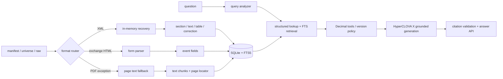

# 공시 Agent 기술 제안서

## 1. 제안 요약

제공된 2023.01~2026.03 공시 코퍼스만을 사용해 정기공시, 주요사항보고서, 거래소공시, 지분공시를 일관된 근거 단위로 구조화한다. 질문에서 회사·기간·공시 유형·지표·연결/별도를 추출해 정형 cell과 event field를 우선 조회하고, 서술 질문은 FTS5 근거를 병합한다. 계산은 `Decimal`로 실행하며, HyperCLOVA X는 최종 근거 문장화에만 사용한다.

핵심 차별점은 "검색용 텍스트"와 "계산용 정형 데이터"를 함께 유지하는 것이다. 숫자를 문자 청크에서 다시 추측하지 않고, 원문 표의 행·열·기간·단위·scope 관계를 그대로 사용한다.

## 2. 문제 정의

공시 원문은 단순 XML 코퍼스가 아니다.

- strict XML이 아닌 bare `&`, 텍스트 `<...>`, 제어문자, 비정상 속성 따옴표가 존재한다.
- 정기공시의 section은 `SECTION-1..6`, `TITLE`, `LIBRARY`, 굵은 `SPAN`으로 혼재한다.
- 표 하나는 제목, 단위, 여러 physical table, 주석이 합쳐진 logical table일 수 있다.
- `ROWSPAN/COLSPAN`, 다단 헤더, `TH/TD/TE/TU`를 풀지 않으면 숫자의 행·열 관계가 깨진다.
- 정정공시에는 정정 전·후와 정정된 전체 본문이 함께 존재한다.
- 확장자는 `.xml`이지만 실제 내용이 HTML인 거래소 공시와, XML이 없는 `pdf+html` 예외 3건이 있다.

따라서 LLM에 원문을 통째로 넣는 방식은 재현성, 수치 정확성, 근거 위치, 정정본 선택을 보장하지 못한다.

## 3. 제안 방법

### 3.1 원문 보존과 복구

원본 `raw` 파일은 절대 수정하지 않는다. strict parse 실패 시에만 메모리 내 복구를 적용하고, SHA-256·복구 규칙·횟수·warning을 남긴다. 복구 후에도 파싱할 수 없는 파일은 문서 단위 `failed`로 격리하여 배치 전체를 중단하지 않는다.

### 3.2 공통 교환 스키마

다음 계층을 분리한다.

- `document`: 기업, 보고서, 접수, 기준 기간, 파싱 상태, 최신 버전
- `section`: 제목 계층과 원문 위치
- `text_chunk`: 상위 section 문맥을 반복한 검색 단위
- `logical_table`: 제목·단위·scope·기간·열·행·주석
- `table_cell`: row label, column path, original text, numeric value, unit, period, scope
- `correction`: original/before/after/current effective value과 version link
- `event`: 주요사항·거래소·지분공시의 의미 필드

교환 JSON은 출처 메타데이터를 각 조각에 반복하고, SQLite에서는 `doc_id`를 중심으로 정규화해 중복 저장을 줄인다.

### 3.3 검색과 계산

1. 질문에서 회사, 종목코드, 연도, 월/분기, annual/half/quarter, scope, 지표, intent를 추출한다.
2. 재무 지표는 `cells`, 계약·지분 지표는 `event_fields`를 먼저 조회한다.
3. 서술 근거는 `chunks_fts`, `tables_fts`, `events_fts`를 메타데이터 필터 안에서 검색한다.
4. 기본은 `is_latest_version=1`이며, "정정 전"을 요청할 때만 이전 버전을 포함한다.
5. 증감, 합계, 비율, 기업 간 비교는 원문 숫자 문자열을 `Decimal`로 변환해 실행한다.
6. 단위·통화·scope가 호환되지 않으면 자동 계산하지 않는다.

### 3.4 HyperCLOVA X의 역할

HyperCLOVA X는 공시 근거 최대 10건을 사용해 답변을 문장화한다. 각 핵심 주장은 `[근거 n]`을 인용해야 하며, 인용 번호 검증에 실패하면 결정론적 템플릿으로 fallback한다. 다른 LLM 공급자는 코드에 포함하지 않았다.

## 4. 시스템 구성

## 5. 주요 기능 흐름

### 수치 조회

`삼성전자 2023년 1분기 연결 영업이익은?`에서 회사, 2023, quarter, 1분기, consolidated, operating_profit을 추출한다. 일치하는 latest document의 cell을 검색하고, 표 제목·행·열·단위·접수번호를 함께 반환한다.

### 기업 간 비교

두 기업의 동일 지표를 각각 선택하고, KRW scale을 환산한 후 크기를 비교한다. 답변에는 양사 원문 표시값과 단위, 판정, 양쪽 근거를 모두 포함한다.

### 정정 이력

정정 표의 before/after를 모두 보존하고, 버전 체인의 최종 문서만 current effective로 선택한다. 이력 질문은 정정 사유·이전값·이후값·접수일을 함께 보여준다.

### 정보 한계

회사·기간·지표가 코퍼스에 없거나 주가·뉴스·투자 추천을 요구하면 추정하지 않고 명시적으로 거절한다.

## 6. 안전성과 신뢰성

- 제공 코퍼스 외 웹·뉴스·OpenDART runtime을 사실 근거로 사용하지 않는다.
- 지분공시의 주민번호·사업자번호·휴대전화·이메일 형식을 파생 검색 텍스트에서 마스킹한다.
- 질문과 검색 문서를 untrusted data로 처리해 프롬프트 내 지시 삽입을 무시한다.
- HyperCLOVA X 인용 번호가 실제 context 범위인지 검증한다.
- 배치는 문서별 transaction, 재실행 스킵, 단일 writer lock, 문서별 JSONL 로그를 사용한다.

## 7. 사용자 시나리오

1. 애널리스트가 특정 기업의 연결 매출을 질문한다.
2. Agent가 회사·기간·scope를 제한하고 수치 cell과 주석 context를 찾는다.
3. 표시값, 단위, 표 제목, 접수번호를 포함한 답변을 받는다.
4. 이어서 다른 기업과 비교를 요청하면 동일 지표·기간·통화를 맞춰 계산한다.
5. 근거 항목을 통해 접수번호와 표 cell까지 역추적한다.

## 8. 기대 효과와 확장성

- 반복되는 공시 찾기·표 수치 대조·정정 이력 확인 시간을 줄인다.
- 모델 교체 없이 parser·retrieval·calculation을 독립적으로 회귀 테스트할 수 있다.
- SQLite/FTS5 MVP는 단일 배포를 단순화하며, 후속 단계에서 동일 JSON 교환 스키마를 유지한 채 전문 검색 엔진·vector reranker·version graph로 확장할 수 있다.
- 이미지 자산이 추가되면 현재 image metadata와 locator를 기준으로 OCR/vision 결과를 연결할 수 있다.

## 9. 재현과 제출

소스, `requirements.txt`, `pyproject.toml`, Dockerfile, Makefile, README, API 명세, 교환 JSON Schema, 파서·검색·계산 테스트, 교차 대표 문서 검증, base 37개에서 파생한 150개 robustness·50개 strong gold·4040개 산업 확장·18개 운영 경계 질의 평가와 로컬 DB 생성 명령을 제공한다. `submission-check`는 필수 파일과 Git 추적 금지 산출물을 검사한다. 실제 HyperCLOVA X key/endpoint, 배포 endpoint, 대회 GitHub Organization push는 제출 권한을 가진 사용자가 최종 주입·승인한다.
